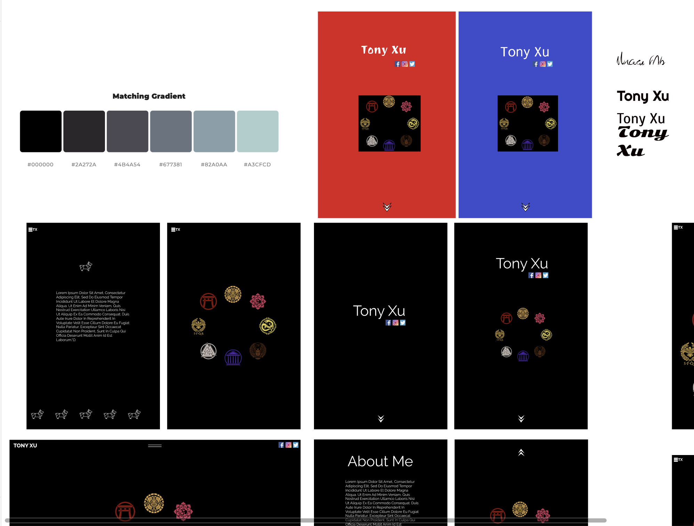

# Tony Xu'sPersonal-Portfolio

[Link here - https://confident-northcutt-5be2ee.netlify.com](https://confident-northcutt-5be2ee.netlify.com)

[Tonys Portfolio GitHub Repo](https://github.com/DesignTX/Personal-Portfolio)

## Purpose

The purpose of this portfolio was to apply the skills I had learnt through Coder Academy.

Through the journey of applying the skills I had already learnt to create my own website I had found a deep fascination in the abilities of CSS and fell down a rabbit hole constantly trying to create and learn new perspectives on how to use CSS by solving issues and creating new patterns and designs for animations / contact forms / buttons.

## Functionality / features

- Navigation Bar
- Smooth Scrolling
- Fully CSS Animated buttons
- Fully CSS Animated Cards

## Target Audience

For the project I didn't have a particular audience I was targetting other than trying to do it for myself, but in the future I hope to learn alot more about web development languages and apply it to this personal portfolio and turn it into a website for potential employers.

## Screenshots

## Plan Screenshots

- Front Page Layout (Plan)
  
- Rough Colour Scheme (Plan)
  
- Icon Design (Plan)
  
- Front Page (Final)
  
- Second Page (Final)
  
- About Me Hover Button (Final)
  
  Contact Form (Final)
  

## Tech stack (e.g. html, css, deployment platform, etc)

- HTML
- CSS

#### Tools

- VS Code
- Github
- Trello
- Figma

## Design process

After seeing some fantastic designers in my cohort, I knew I was out of my league in designing a site featuring beautiful colour scheme blends, therefore I used 3 colours (Black / White / Blue) to create a simplistic design but decided to focus heavily on the coding side, learning and implementing fully CSS coded animations.

## Wireframes

## Project plan & timeline

#### Tuesday 19th - Wednesday 20th

- Wireframes & Mood Boards

#### Thursday 21st - Friday 22nd

- HTML Basics
- CSS Basics

#### Saturday 23rd - Sunday 24th

- CSS Animations

## Screenshots of Trello board(s)

# Describe key events in the development of the internet from the 1980s to today (max. 150 words)

The Internet evolved from more than just schools and government institutions connecting their computers together through a standard protocol called TCIP/IP.

The Bullet Board System(BBSs) emerged in the 1980’s, despite their popularity, BBSs modems were slow. However as they became faster BBSs began creating their own little network by calling each other and exchanging messages.

In 1994 the Internet went public and mainstream. The web exploded with browser wars as Netscape and Internet Explorer, eventually Mozilla Firefox emerged as a competitor in the browser war.

Early websites were great way to exchange information but HTML was very limited

Web 2.0
After the fall of the internet, people came back to reality and were equipped with technologies like Java, Flash, PHP, ASP, CGI, .NET.

Today’s web could is probably more accurately described as Web 3.0 or Web 4.0

# Define and describes the relationship between fundamental aspects of the internet such as: domains, web servers, DNS, and web browsers (max. 150 words)

When you visit a url-website / web address into your browser.

1. The browser goes to the DNS server and finds the real address of the server that the address lives on eg: 198.105.232.4
2. The browser then sends a HTTP request to the server asking it to send it to the client (your device). This message and any other data sent between the client and server is sent across using your TCP/IP
3. Once the server approves the client’s request, the server sends a “200 OK’ which is the okay to view the website by sending the website’s files in small chunks known as data packets
4. The browser assembles the small chunks of data packets into a complete website and displays / renders it

# Reflect on one aspect of the development of internet technologies and how it has contributed to the world today (max. 150 words)

The Internet is the decisive technology of the Information Age, and with the explosion of wireless communication in the early twenty-first century, we can say that humankind is now almost entirely connected, albeit with great levels of inequality in bandwidth, efficiency, and price.

People, companies, and institutions feel the depth of this technological change, but the speed and scope of the transformation has triggered all manner of utopian and dystopian perceptions that, when examined closely through methodologically rigorous empirical research, turn out not to be accurate. For instance, media often report that intense use of the Internet increases the risk of isolation, alienation, and withdrawal from society, but available evidence shows that the Internet neither isolates people nor reduces their sociability; it actually increases sociability, civic engagement, and the intensity of family and friendship relationships, in all cultures.
